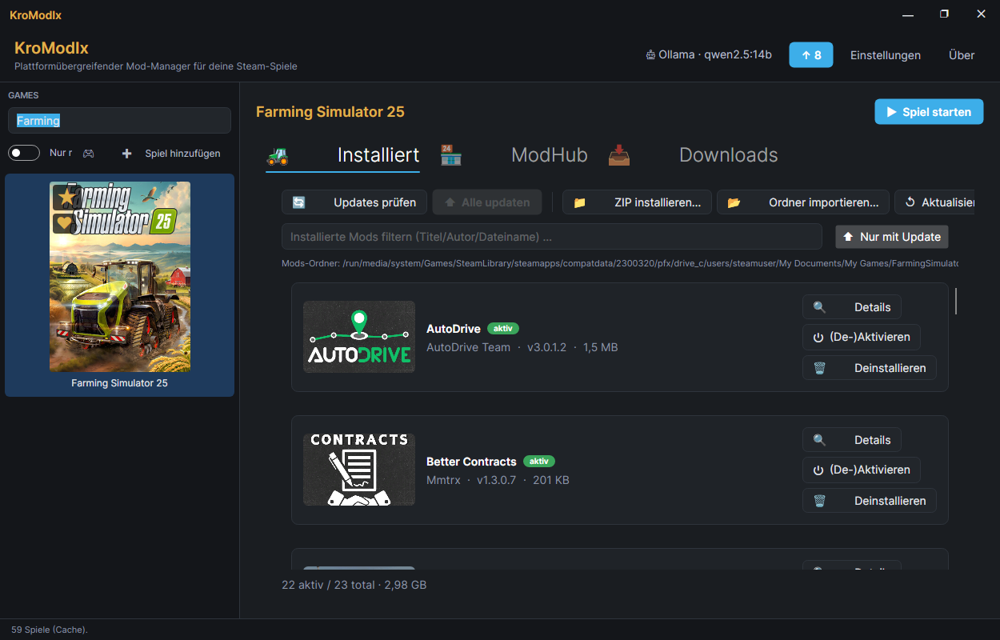
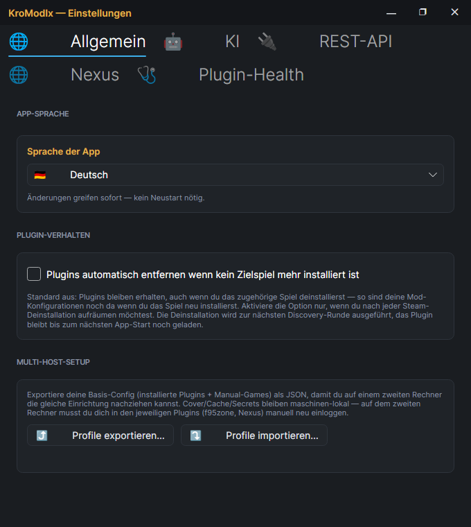

# KroModIx — Kroste Modding MatrIx

[](https://github.com/KroModIx/KroModIx/actions/workflows/ci.yml)
[](https://github.com/KroModIx/KroModIx/releases)
[](LICENSE)

**Ein Mod-Manager für alle deine Steam-Spiele — plattformübergreifend
(Windows + Linux nativ, kein Wine), Steam-aware, per Plugin erweiterbar.**

Ein Fenster, links deine Spiele, rechts der spielspezifische Mod-Manager.
Kein Umschalten zwischen mehreren Tools mehr.

## Screenshots

Hauptfenster — links die Spiele-Sidebar, rechts die Tabs des Plugins für das
gewählte Spiel (hier der Landwirtschafts-Simulator 25):



Einstellungen — App-Sprache, Plugin-Verhalten, KI-Provider, REST-API,
Nexus-API-Key und Plugin-Health in einem Fenster:



## Warum KroModIx?

Die meisten Mod-Manager sind Windows-only, closed-source oder brauchen Wine-
Bastelei auf Linux. Jedes Spiel verlangt sein eigenes Tool. KroModIx macht:

- **Steam-Library-Autodiscovery** (Windows + Linux/Bazzite, inkl. externe
  Platten via `libraryfolders.vdf`)
- **Nicht-Steam-Spiele manuell hinzufügen** — mit eigenem Cover, Executable-
  Pfad und optional Steam-AppId
- **Plugin pro Spiel** — jedes Plugin weiß wie es Mods für sein Spiel
  verwaltet (Katalog, Downloads, Install, Update-Discovery)
- **1-Klick-Plugin-Install** aus dem [PluginIndex](https://github.com/KroModIx/KroModIx.PluginIndex),
  live aktivierbar ohne App-Neustart
- **Automatische Plugin-Updates** aus GitHub-Releases (App-Neustart nötig
  weil die Assembly geladen ist)
- **Grüner ↑-Badge** auf einer Spielkachel wenn es Updates für **installierte
  Mods** gibt (Actionable-Signal — neue Katalog-Einträge zählen bewusst nicht,
  sonst wäre der Pfeil dauerhaft grün)
- **REST-API** für externe Steuerung (Screenshots, Clicks, Tab-Wechsel,
  Plugin-Actions — siehe unten)

## Installation

Aktuelles Release von der [Releases-Seite](https://github.com/KroModIx/KroModIx/releases):

**Windows:** `KroModIx-X.Y.Z-win-x64.zip` — entpacken, `KroModIx.exe`
starten. Self-contained, keine Installation nötig.

**Linux (AppImage, empfohlen):**
```bash
chmod +x KroModIx-*-x86_64.AppImage
./KroModIx-*-x86_64.AppImage
```

**Linux (tar.gz):** `KroModIx-X.Y.Z-linux-x64.tar.gz` entpacken, `./KroModIx`
starten.

## Bedienung

### Sidebar (links)

Zeigt alle installierten Steam-Spiele aus **allen** Library-Roots inkl.
externen Platten. Suchfeld filtert nach Titel, der „Alle Spiele"-Toggle
wechselt zwischen „nur mit Plugin" und „alle". Sortierung: Plugins zuerst,
dann alphabetisch. Steam-Tools (Runtimes, Proton-Versionen, Redistributables)
werden ausgeblendet.

**➕ Spiel hinzufügen** — für Nicht-Steam-Spiele: Name + Verzeichnis
(Pflicht) + Executable + Cover + optional Steam-AppId (lädt bei gesetzter
AppId das Cover automatisch aus dem Steam-CDN). Einträge persistieren in
`~/.config/KroModIx/manual-games.json`.

### Kachel-Overlays

- **★ (gefüllt gold)** = Plugin geladen und aktiv
- **☆ (umrandet gold)** = Plugin im PluginIndex verfügbar, noch nicht installiert
- **↑ (grün, oben rechts)** = Updates für installierte Mods dieses Spiels
  (nur echte Actionable-Updates — nicht Community-Katalog-News)

**Klick auf Spiel mit umrandetem Stern** → Install-Karte im Content-Bereich:
„Plugin verfügbar. ⬇ Installieren". Ein Klick lädt das Plugin aus dem
GitHub-Release, entpackt, aktiviert live — der Stern wird sofort gefüllt und
die Plugin-Tabs erscheinen.

**Klick auf Spiel mit gefülltem Stern** → die Plugin-Tabs rendern im
Content-Bereich (Katalog / Downloads / Installiert / Einstellungen — je
nach Plugin).

### Backups

Plugins legen vor jedem Mod-Install einen Snapshot des betroffenen
Spielverzeichnisses an. Über das **Kontextmenü einer Sidebar-Kachel →
„Backups"** siehst du alle Snapshots zu diesem Spiel mit Datum, Anlass und
Größe und kannst einen davon zurückspielen. Das Ziel-Verzeichnis wird dabei
vorher nach `<ordner>.pre-restore/` umbenannt — auch der Restore hat also ein
Netz. Aufbewahrt werden die letzten zehn Snapshots pro Spiel und Plugin,
abgelegt unter `~/.local/share/KroModIx/backups/` bzw.
`%LOCALAPPDATA%\KroModIx\backups\`.

## Verfügbare Plugins

| Plugin | Repo | Was |
|---|---|---|
| Landwirtschafts-Simulator 25 | [KroModIx.Plugin.LS25](https://github.com/KroModIx/KroModIx.Plugin.LS25) | GIANTS ModHub + Hof Hirschfeld + modhoster, DDS-Preview, Backup/Restore, KI-Zusammenfassung, Bulk-ZIP-Import |
| Satisfactory | [KroModIx.Plugin.Satisfactory](https://github.com/KroModIx/KroModIx.Plugin.Satisfactory) | ficsit.app-Katalog via GraphQL, `.smod`-Direct-Download, `.uplugin`-Manifest |
| Icarus | [KroModIx.Plugin.Icarus](https://github.com/KroModIx/KroModIx.Plugin.Icarus) | Nexus-Katalog, PAK-Manual + Steam-Workshop, Premium-Direct-Download, Detail-Dialog mit Screenshot-Galerie |
| Cyberpunk 2077 | [KroModIx.Plugin.Cyberpunk2077](https://github.com/KroModIx/KroModIx.Plugin.Cyberpunk2077) | Alle fünf Mod-Typen (Archive/REDmod/CET/RED4ext/redscript), **Voll-Katalog via Nexus-GraphQL (~23000 Mods, Pagination + Server-Search + Sort)**, Detail-Dialog mit Screenshot-Galerie + KI-Zusammenfassung, ZIP/RAR/7z-Install mit Auto-Layout, Downloads- + Installiert-Tab mit Nexus-Enrichment (Cover + Author + Version), DE+EN-Übersetzung |
| Ren'Py Assist | [KroModIx.Plugin.RenPyAssist](https://github.com/KroModIx/KroModIx.Plugin.RenPyAssist) | f95zone-Anbindung mit Login, Sub-Path-Rotation für Updates, RPA-Browser + Save-Editor, KrosteMod-Pipeline (Walkthrough/Cheat/Rename/Translate), **Standalone-.rpyc-Decompiler** (portiert aus RenPack, cross-platform ohne Python), Inline-Video-Playback, animierte GIF-Cover |
| Dummy | [KroModIx.Plugin.Dummy](https://github.com/KroModIx/KroModIx.Plugin.Dummy) | Demo-Plugin für Entwicklungs-Tests |

Der Katalog steht in [KroModIx.PluginIndex](https://github.com/KroModIx/KroModIx.PluginIndex).
Eigenes Plugin? PR gegen die `plugins.json` schicken.

## REST-API

Der Host hat eine optionale REST-API zur externen Steuerung. Standardmäßig
aus (kein Netz-Listener). Anschalten:

```bash
KroModIx --api-port 8765 --api-token <secret> --auto-shutdown-after 5m
```

Oder persistent in `~/.config/KroModIx/settings.json` (`ApiEnabled: true`
+ `ApiBearerToken`).

Endpoints (Auszug):
- `GET /state` — aktueller App-Zustand (aktives Spiel, geladene Plugins)
- `GET /games` — alle Steam- und Manual-Spiele
- `POST /select-game { gameId }` — Sidebar-Kachel wählen
- `POST /select-tab { tabId }` — Plugin-Tab wechseln
- `POST /screenshot` — PNG-Screenshot des Hauptfensters
- `POST /events/click { elementId }` — auf Named-Control klicken
- `GET /badges` — aktuelle Update-Badges pro Steam-AppId

Auth via `Authorization: Bearer <token>`. Doku im (privaten) Repo
[KroModIx.RestApi](https://github.com/KroModIx/KroModIx.RestApi).

## Roadmap

| Milestone | Status | Was |
|---|---|---|
| M1 Foundation | ✅ | Shell, Tray, About/Settings, Self-Update via GitHub-Releases |
| M2 Steam-Discovery + Plugin-Loader | ✅ | Sidebar mit großen Cover-Kacheln, manueller Add, Plugin-Scan + Aktivierung |
| M3 LS25-Plugin | ✅ | Installiert-Tab, ModHub-Katalog, Detail-Dialog, KI-Zusammenfassung |
| M4 PluginIndex + Install-Karte + Live-Aktivierung | ✅ | 1-Klick-Install ohne Restart |
| M4.5 Plugin-Update-Service | ✅ | Update-Badge im Header + Install-Flow mit Restart-Hinweis |
| M5 Icarus-Plugin | ✅ | Nexus-Katalog, PAK-Manual + Steam-Workshop |
| M6 Satisfactory-Plugin | ✅ | ficsit.app GraphQL, `.smod`-Install |
| REST-API (Phase 2) | ✅ | External-Control, Screenshots, Clicks, Tab-Wechsel |
| KI-Erweiterung (Phase 3) | ✅ | Ollama + Cloud-Provider mit Modell-Discovery |
| Sidebar-Verhalten (Phase 4) | ✅ | Toasts, Auto-Cleanup, Kachel-Badges |
| M7 Ren'Py-Plugin | ✅ | RenPyAssist mit f95zone-Anbindung, RPA-Browser, KrosteMod-Pipeline (Walkthrough/Cheat/Rename/Translate), Inline-Video-Playback, animierte GIF-Cover, Screenshot-Timeline |
| Plugin-Update-Cache (v1.10.2) | ✅ | Rate-Limit-Fallback + persistenter Cache in `~/.config/KroModIx/plugin-update-cache.json` — Update-Info überlebt GitHub 403er + Restarts |
| Container-Rename-API (v1.10.3) | ✅ | Plugins können via `IHostServices.TryRenameManualGame` Container-Ordner umbenennen, Host re-keyed Sidebar-Kachel + Manual-Games-Store atomar |
| Plugin-Manager-Suchfilter (v1.10.4) | ✅ | Live-Filter über "Verfügbare Updates" + "Installierte Plugins" nach Name oder Plugin-ID |
| PluginIndex-Kategorien (v1.11.0) | ✅ | Genre-Chips im InstallCard (`categories`-Feld im `plugins.json`) |
| Multi-Host-Profile (v1.12.0) | ✅ | Export/Import von Plugin-Liste + Manual-Games als JSON zum Nachziehen auf einem zweiten Rechner (Settings-Fenster) |
| Favoriten + Update-Sortierung (v1.13.0) | ✅ | Rechtsklick-Toggle „⭐ Favorit" pro Sidebar-Kachel, Sortierung: Favoriten > Games mit Update > mit Plugin > Rest. Header-Badge „🎮 N Mod-Updates" |
| Nexus-Baukasten (v1.14.0) | ✅ | `IHostServices.Nexus`-Contract, geteilter API-Key im Host-Settings-Tab „🌐 Nexus". Alle Nexus-basierten Plugins (Icarus, Cyberpunk, künftige) teilen ihn. |
| Nexus-Auto-Validate + IsPremium-Event (v1.14.2) | ✅ | App-Start triggert `ValidateAsync` wenn ein Key im Store liegt, `ApiKeyChanged` feuert auch nach dem Validate — Premium-Download-Buttons in Plugins funktionieren ohne Settings-Fenster-Reopen |
| Plugin-Manager-Dedup (v1.14.3) | ✅ | Installiert-Liste dedupt per PluginId (Bundled- vs. User-Ordner-Kollision) + UpdatesChanged auf UI-Thread |
| Plugin-Tab-Views persistent (v1.14.4–v1.14.6) | ✅ | `RefreshPluginStates` und `ApplyFilterAndSort` verwerfen keine geladenen Plugin-VMs mehr; Tab-Cache pro Game — Wechsel + Zurück behält Cover/Screenshots/Detail-State |
| Sprachwechsel invalidiert Tab-Cache (v1.14.7) | ✅ | Übersetzungen im Plugin (via `Strings.T(key)`) werden sofort nach Sprachwechsel im Content sichtbar |
| Nexus-Voll-Katalog via GraphQL (v1.15.0) | ✅ | `INexusService.SearchModsAsync` — Pagination + Server-side Volltextsuche + 4 Sort-Optionen. REST-v1-Endpoints geben nur ~20 Kurzlisten-Einträge, GraphQL deckt den kompletten Bestand ab (Cyberpunk 23000+, Skyrim 70000+) |
| Plugin-Sichtbarkeits-Debug (v1.15.1) | ✅ | `Log.Debug` in `PluginActivator` gibt bei jedem Plugin-Load die DetectedGames-InstallDirs aus — bei „Plugin nicht sichtbar für X"-Bugreports sofort verfügbar |
| Live-Manual-Add-Contract (v1.17.0) | ✅ | Neues Spiel per „➕ hinzufügen" landet ohne App-Neustart in geladenen Plugins — Contract `IGameModPlugin.OnGameAddedAsync` + `PluginActivator.NotifyGameAddedAsync` propagieren an alle geladenen Plugins mit Match. Sidebar-Kachel + Plugin-State sofort korrekt. |
| Kategorien-Sidebar-Suche (v1.17.0) | ✅ | Sidebar-Suchfeld matcht jetzt zusätzlich zu Spielnamen auch die `categories` aus dem PluginIndex — „RPG" filtert alle Games mit Plugins die `"categories": ["RPG"]` deklarieren |
| Auto-Update-Notifier (v1.17.0) | ✅ | 24h-Timer im Hintergrund, bei neuer Host-Version ein Toast (kein Auto-Install — User klickt im About-Dialog) |
| Debug-Endpoint `/debug/plugin-games` (v1.17.0) | ✅ | REST-API liefert pro geladenem Plugin die DetectedGames mit InstallDirs — schnelle Diagnose bei „Plugin nicht sichtbar"-Bugs |
| Steam-Workshop-Baukasten (v1.17.0) | ✅ | `IHostServices.Workshop`-Contract: Discovery via `workshop/content/<appId>/` in allen Steam-Library-Roots + optional Web-API-Enrichment (`GetPublishedFileDetails`). LS25/Icarus/Satisfactory können einen einheitlichen Workshop-Tab bauen ohne Pfad-Discovery selbst zu machen. |
| App-Icon-Facelift (v1.17.0) | ✅ | `scripts/build_icon.py v2`: gestapelte Kroste-Gold-Cards + Stern-Akzent auf vertikalem Dark-Gradient — neu generiert (PNG 512×512 + ICO Multi-Res) |

## Entwicklung

```bash
dotnet build          # Build
dotnet test           # Tests
dotnet run --project KroModIx
```

Release: Tag `vX.Y.Z` setzen und pushen — GitHub-Action baut Windows-ZIP,
Linux-tar.gz und AppImage.

## Logs

Log-Files unter `logs/` neben der Executable (Tages-Archive, 14 Tage).
Passwörter und Tokens werden automatisch maskiert. Bei Issues die aktuelle
Log-Datei mitschicken.

## Lizenz

MIT — siehe [LICENSE](LICENSE).

---

☕ [buymeacoffee.com/kroste](https://buymeacoffee.com/kroste)
